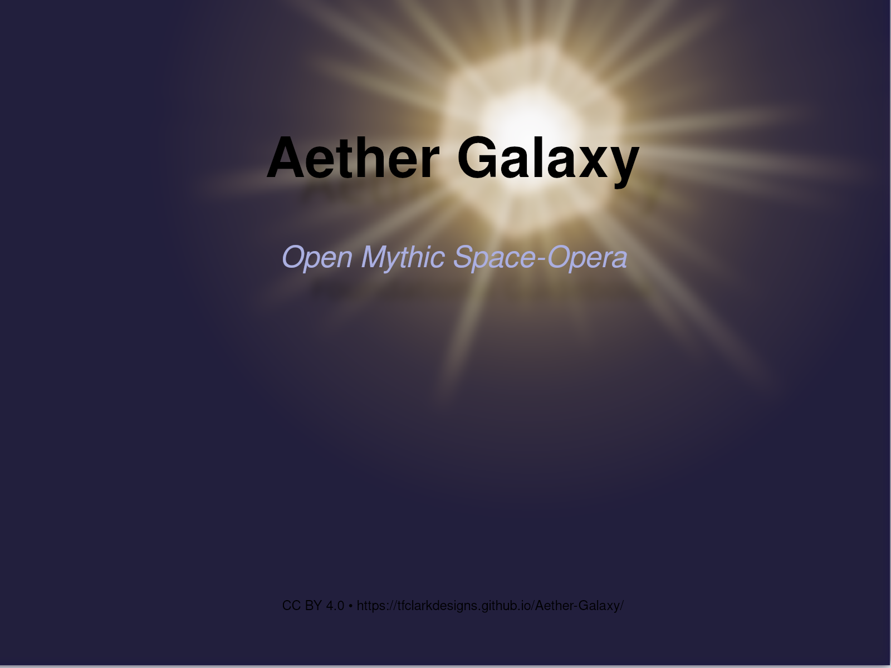

# Aether Galaxy

  

*An open Creative Commons mythic space-opera setting by Terrance Clark.*

---

### Overview
**Aether Galaxy** (also called the **Aetherverse**) is an open-licensed framework for writers, GMs, and world-builders who want a mythic, lived-in science-fiction universe to share and expand.  
All text and artwork released here are covered by the [Creative Commons Attribution 4.0 International License (CC BY 4.0)](https://creativecommons.org/licenses/by/4.0/).

> “No canon, only coherence.”

---

### Core Material
**Foundational Guidebook** - the living heart of the whole project; start here
- **[Foundational Guidebook (Markdown)](https://github.com/tfclarkdesigns/Aether-Galaxy/blob/main/docs/files/latest/markdown/aether-galaxy-foundational-guidebook.md)**  
- **[Foundational Guidebook (PDF)](https://github.com/tfclarkdesigns/Aether-Galaxy/blob/main/docs/files/latest/PDF/aether-galaxy-foundational-guidebook.pdf)**  

---
### Project Updates
**Report on the Galaxy** - a change, update, and progress log for Aether Galaxy  
- **[Report on the Galaxy (Markdown only)](https://github.com/tfclarkdesigns/Aether-Galaxy/blob/main/docs/files/latest/markdown/report-on-the-galaxy.md)** 

---

### Supplementary Documents  
**Astrogation Holocodex** - A standardized reference defining stellar addresses and methods for calculating spatial distances and hyperspace travel times

- **[Astrogation Holocodex  (Markdown)](https://github.com/tfclarkdesigns/Aether-Galaxy/blob/main/docs/files/latest/markdown/astrogation-holocodex.md)** 
- **[Astrogation Holocodex (PDF)](https://github.com/tfclarkdesigns/Aether-Galaxy/blob/main/docs/files/latest/PDF/astrogation-holocodex.pdf)** 

**Field Catalog of Weros** - An in-universe guide to galactic gear, framed as a visit to a Weros equipment trader
- **[Field Catalog of Weros  (Markdown)](https://github.com/tfclarkdesigns/Aether-Galaxy/blob/main/docs/files/latest/markdown/field-catalog-of-weros.md)**  
- **[Field Catalog of Weros (PDF)](https://github.com/tfclarkdesigns/Aether-Galaxy/blob/main/docs/files/latest/PDF/field-catalog-of-weros.pdf)**

**The Will of Order** - The Iron Dominion’s own account of its creed
- **[The Will of Order (Markdown)](https://github.com/tfclarkdesigns/Aether-Galaxy/blob/main/docs/files/latest/markdown/the-will-of-order.md)**
- **[The Will of Order (PDF)](https://github.com/tfclarkdesigns/Aether-Galaxy/blob/main/docs/files/latest/PDF/the-will-of-order.pdf)**

---

### Narrative Works  
**Archives of the Lost**  - Stories of people whose lives were cut short too soon
- **[Archives of the Lost, Volume 1 (Markdown)](https://github.com/tfclarkdesigns/Aether-Galaxy/blob/main/docs/files/latest/markdown/archives-of-the-lost-volume1.md)**
- **[Archives of the Lost, Volume 1 (PDF)](https://github.com/tfclarkdesigns/Aether-Galaxy/blob/main/docs/files/latest/PDF/archives-of-the-lost-volume1.pdf)**

**The Kols Files** - The adventures of a human young bounty hunter
- **[The Kols Files, Chapter 1 (Markdown)](https://github.com/tfclarkdesigns/Aether-Galaxy/blob/main/docs/files/latest/markdown/the-kols-files-ch1.md)**
- **[The Kols Files, Chapter 1 (PDF)](https://github.com/tfclarkdesigns/Aether-Galaxy/blob/main/docs/files/latest/PDF/the-kols-files-ch1.pdf)**
- **[The Kols Files, Chapter 2  (Markdown)](https://github.com/tfclarkdesigns/Aether-Galaxy/blob/main/docs/files/latest/markdown/the-kols-files-ch2.md)**
- **[The Kols Files, Chapter 2 (PDF)](https://github.com/tfclarkdesigns/Aether-Galaxy/blob/main/docs/files/latest/PDF/the-kols-files-ch2.pdf)**
- **[The Kols Files, Chapter 3  (Markdown)](https://github.com/tfclarkdesigns/Aether-Galaxy/blob/main/docs/files/latest/markdown/the-kols-files-ch3.md)**
- **[The Kols Files, Chapter 3 (PDF)](https://github.com/tfclarkdesigns/Aether-Galaxy/blob/main/docs/files/latest/PDF/the-kols-files-ch3.pdf)**

*(All files are hosted in this GitHub repository for transparency and version tracking.)*

---

### Project Repositories
- **Primary GitHub Repository:** [tfclarkdesigns/Aether-Galaxy](https://github.com/tfclarkdesigns/Aether-Galaxy)  
- **Permanent Archive:** [Internet Archive Collection – @aethergalaxyoriginal](https://archive.org/details/@aethergalaxyoriginal)  
- **Mastodon Updates:** [Follow @AetherGalaxy@mastodon.social](https://mastodon.social/@tfclark)  

---

### License
All original material is released under **[Creative Commons Attribution 4.0 International CC BY 4.0](https://creativecommons.org/licenses/by/4.0/**).  
You may reuse, remix, or build upon this work — commercially or otherwise — provided you give appropriate credit:

> *“Based on Aether Galaxy (CC BY 4.0) by Terrance Clark — https://github.com/tfclarkdesigns/Aether-Galaxy”*

---

### Purpose
*Aether Galaxy* is designed as a shared mythic commons:  
a space where multiple creators can tell stories that remain compatible through tone and coherence, not canonical control.  
The project invites reinterpretation, translation, and expansion while preserving a clear legal and philosophical foundation.

---

_Last updated {{ site.time | date: "%B %Y" }}_ 
